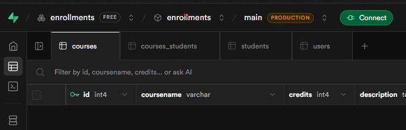

# Laboratorio 05: Base de Datos - Sistema de Matrículas

## Entregables
| Entregables | URL |
| :--- | :--- |
| Repositorio | https://github.com/rescobedoq/enrollments.git |
| Informe PDF | https://github.com/rescobedoq/enrollments/blob/main/informes/DAW_lab05_bd.pdf |

## 1. Descripción de la Práctica
Este laboratorio consiste en el diseño lógico, la implementación física y el despliegue en la nube de una base de datos relacional orientada al control de matrículas académicas (`enrollments`). Se han seguido estrictamente todos los estándares internacionales de diseño y las recomendaciones específicas brindadas por la cátedra.

## 2. Modelo Lógico (DER)
El modelo cuenta con las entidades principales para gestionar alumnos, cursos, cuentas de usuarios y la relación correspondiente de inscripciones.

*(Inserta aquí la imagen de tu diagrama)*

## 3. Estándares de Diseño Aplicados
- **Idioma:** Nomenclatura 100% en inglés.
- **Pluralización:** Tablas definidas en plural (`users`, `students`, `courses`, `courses_students`).
- **Capitalización:** Atributos compuestos escritos bajo el estándar `camelCase` (ej. `fatherSurname`, `motherSurname`, `courseName`, `enrollmentDate`).
- **Campos de Auditoría Obligatorios:** Todas las tablas incluyen los campos `id`, `status`, `created`, `modified`, `created_id` y `modified_id`.
- **Llaves Foráneas:** Identificadas mediante el sufijo `_id` precedido por el nombre en singular de la tabla primaria asociada.
- **Relación N:M:** La tabla intermedia `courses_students` ha sido nombrada respetando estrictamente el orden alfabético (*C* antes de la *S*).

## 4. Implementación en Supabase
La base de datos se encuentra desplegada exitosamente en Supabase (PostgreSQL en la nube). 

## Referencias
- https://supabase.com/
- https://www.postgresql.org/docs/current/index.html